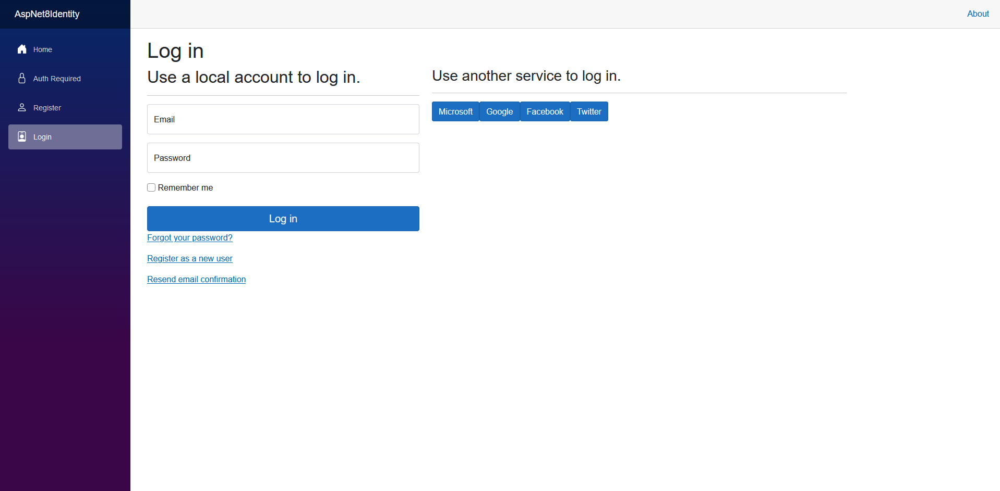
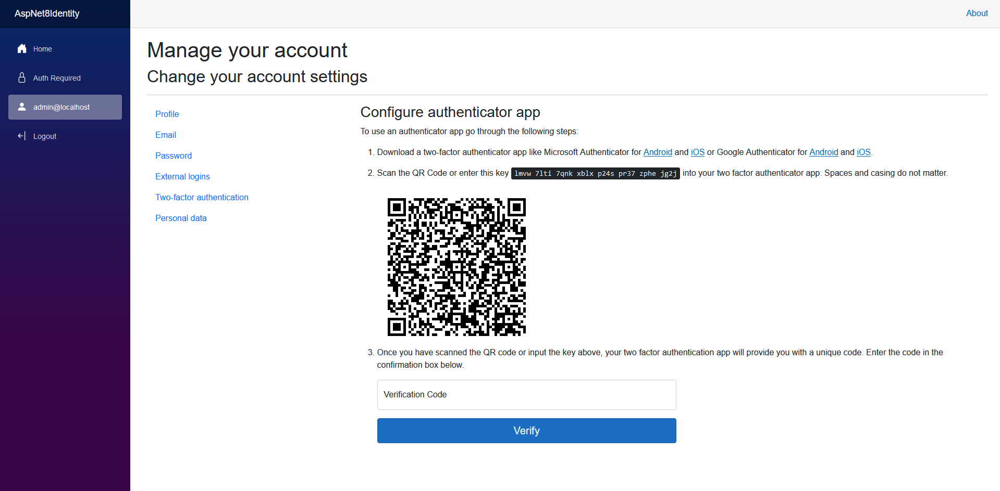

# ASP.NET 8 Identity

This project is an ASP.NET Core 8 application that provides identity and authentication features. It includes an implementation for the `IEmailSender` interface using `SendGrid`, external login providers templates, QR code generation for 2FA and structured logging with `Serilog`. The application is designed to be easy to configure and run, with an `SQLite` database, so no additional database setup is required.

## Features

   **This project starts with boilerplate code for ASP.NET Core Identity and includes custom implementations for various features:**

   - Integrated `SendGrid` to send confirmation emails and password reset emails.
   - Configured external login options with `Microsoft`, `Google`, `Facebook`, and `Twitter`.
   - Automatically assigns roles and seeds the database with default values, including an admin user.
   - Generates QR codes for two-factor authentication (2FA) using the `QRCoder` library.
   - Implemented `Serilog` for logging.

   Below are some screenshots showcasing the various features of the project. These images provide a glimpse into the functionality and user interface, allowing you to see what the project offers before    downloading and running it.

## Screenshots

### External Service Login And [Register](docs/ExternalServiceRegister.png)


### QR Code for 2FA


### [Serilog Logging Example](docs/SerilogLogging.png)

## Getting Started

### Minimal Prerequisites

- [.NET 8 SDK](https://dotnet.microsoft.com/download/dotnet/8.0)

### Configuration

To enable email sender and external login providers, you will need to configure the following:

1. **SendGrid API Key:**

   Sign up for a [SendGrid Account](https://sendgrid.com/) and obtain an API key. Then, add your SendGrid API key in `appsettings.json`:

   ```json
   "EmailSettings": {
     "ApiKey": "YourSendGridApiKey",
     "FromAddress": "your.email@example.com",
     "FromName": "Your Name"
   }
   ```

2. **External Login Providers:**

   To use external login options ([Microsoft](https://learn.microsoft.com/en-us/aspnet/core/security/authentication/social/microsoft-logins?view=aspnetcore-8.0), [Google](https://learn.microsoft.com/en-us/aspnet/core/security/authentication/social/google-logins?view=aspnetcore-8.0), [Facebook](https://learn.microsoft.com/en-us/aspnet/core/security/authentication/social/facebook-logins?view=aspnetcore-8.0), [Twitter](https://learn.microsoft.com/en-us/aspnet/core/security/authentication/social/twitter-logins?view=aspnetcore-8.0)), you need to register your application with these providers and obtain the necessary credentials. Add these credentials in `appsettings.json`:
   ```json
   "AuthSettings": {
      "Microsoft": {
         "Key": "YourMicrosoftClientId",
         "Secret": "YourMicrosoftClientSecret"
      },
      "Google": {
         "Key": "YourGoogleClientId",
         "Secret": "YourGoogleClientSecret"
      },
      "Facebook": {
         "Key": "YourFacebookAppId",
         "Secret": "YourFacebookAppSecret"
      },
      "Twitter": {
         "Key": "YourTwitterConsumerKey",
         "Secret": "YourTwitterConsumerSecret"
      }
   }
   ```

For more details on how to configure these providers, refer to [this article](https://learn.microsoft.com/en-us/aspnet/core/security/authentication/social/?view=aspnetcore-8.0&tabs=visual-studio).
